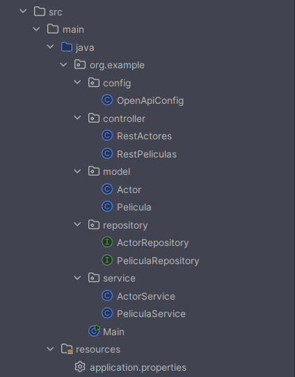
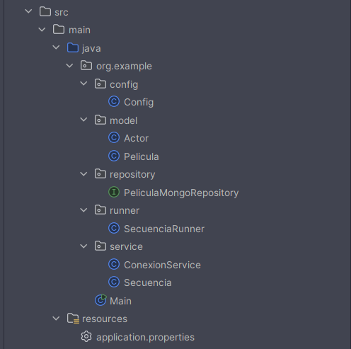

# AD 


---

## PASOS INICIALES 🐲

>[!TIP]
> 1. ***Levantar la máquina virtual, asegurar la correcta conexión y accesibilidad con la VM, postgres y mongoDB***
> 2. ***Lanzar el script de creación de tablas para postgreSQL***
> 3. ***Configuración del application.properties***

---

# CONFIGURACIÓN DE PELISPOSTGRES 🦦

> [!NOTE]
> ***Empezamos primero a configurar PelisPostgres***

---

### ESTRUCTURA DE ARCHIVOS




### ESTRUCTURA SQL ⛓️‍💥

```SQL
CREATE TABLE peliculas (
    idPelicula SERIAL PRIMARY KEY, -- IDENTIFICADOR ÚNICO AUTOINCREMENTAL QUE ACTÚA COMO CLAVE PRIMARIA
    titulo VARCHAR(150),           
    xenero VARCHAR(50),          
    ano INT                     
);

CREATE TABLE actores (
    idActor SERIAL PRIMARY KEY,    
    nome VARCHAR(100),             
    apelidos VARCHAR(100),         
    nacionalidade VARCHAR(100),    
    id_pelicula INT REFERENCES peliculas (idPelicula) -- CLAVE FORÁNEA QUE CONECTA AL ACTOR CON UNA PELÍCULA ESPECÍFICA 
);
```

---

### APPLICATION.PROPERTIES 🥣

> [!CAUTION]
> ***Este archivo define las propiedades necesarias para que el microservicio sepa donde conectarse y qué puerto escuchar.***

```java
spring.datasource.url=jdbc:postgresql://172.20.10.2:5432/postgres 
spring.datasource.username=postgres 
spring.datasource.password=postgres 
spring.datasource.driver-class-name=org.postgresql.Driver 
spring.jpa.properties.hibernate.dialect=org.hibernate.dialect.PostgreSQLDialect 
spring.jpa.hibernate.ddl-auto=update 
server.port=8085 
```

---


### MODEL/ENTIDADES Pelicula.java Y Actor.java 🎨🎨

- **Al definir una clase como @Entity, le decimos a Spring que cree una tabla basada en esa clase y, con @Tbale( name = "actores") aseguras que en postgres sea exactamente el nomnbre que indicamos. Hay que diferenciar una cosa, en Java, en este microservicio por ejemplo, Actor tiene un objeto de tipo Película dentro `private Pelicula pelicula;` , en SQL, Actor solo tiene el ID de la película en la columna correspodiente ( la columna de la clave foránea id_pelicula ).**

> [!CAUTION]
> ***En JPA ( API de Java ) estas clases representan las tablas de la bas de datos, los nombres de los campos deben coincidir con las columnas que definen el script SQL para que el mapeo ( la traducción de java a SQL ) sea automática. En este microservicio usamos JPA ( Jakarta Persistence API ). Su función se resume al mapeo relacional, le dice al programa que la clase actor es la tabla actores, además de definir la clave foránea de esa clase.***

> [!NOTE]
> ***La relación @ManyToOne en el archivo Actor.java de este microservicio define que muchos actores pertenecen a una pelicula. en el código se define como @ManyToOne(fetch = FetchType.EAGER), además, tendremos que indicarle la columna que será la clave foránea de la en la tabla, @JoinColumn(name = "id_pelicula").***


```java
package org.example.model;

import jakarta.persistence.*;
import com.fasterxml.jackson.annotation.JsonIgnore;

@Entity
@Table(name = "actores")
public class Actor {

    @Id // ESTA ANOTACIÓN DEFINE EL ATRIBUTO COMO LA CLAVE PRIMARIA ÚNICA DE LA TABLA PARA QUE JPA PUEDA IDENTIFICAR CADA REGISTRO DE FORMA INDIVIDUAL
    @GeneratedValue(strategy = GenerationType.IDENTITY) // ESTABLECE QUE EL VALOR DEL IDENTIFICADOR ES AUTOINCREMENTAL Y QUE LA RESPONSABILIDAD DE GENERARLO RECAE EN EL TIPO "SERIAL" DE POSTGRESQL
    @Column(name = "idActor") // ASOCIA EXPLÍCITAMENTE ESTE ATRIBUTO DE JAVA CON EL NOMBRE EXACTO DE LA COLUMNA DEFINIDA EN EL SCRIPT DE CREACIÓN DE LA BASE DE DATOS
    private Integer idActor;

    private String nome;
    private String apelidos;
    private String nacionalidade;

    @ManyToOne(fetch = FetchType.LAZY) // ESTABLECE UNA RELACIÓN DE "MUCHOS A UNO" INDICANDO QUE MÚLTIPLES ACTORES PUEDEN ESTAR VINCULADOS A UNA ÚNICA PELÍCULA, CARGANDO LOS DATOS SOLO CUANDO SEAN NECESARIOS PARA AHORRAR MEMORIA
    @JoinColumn(name = "id_pelicula", referencedColumnName = "idPelicula") // DEFINE LA COLUMNA QUE ACTÚA COMO CLAVE FORÁNEA EN LA TABLA ACTORES Y ESPECIFICA QUE SE CONECTA CON LA COLUMNA IDPELICULA DE LA TABLA PELICULAS
    @JsonIgnore // ESTA ANOTACIÓN ES CRUCIAL PARA EL MICROSERVICIO PORQUE EVITA LA RECURSIÓN INFINITA AL TRANSFORMAR EL OBJETO A JSON, IMPIDIENDO QUE EL ACTOR INTENTE SERIALIZAR SU PELÍCULA Y ESTA A SU VEZ A SUS ACTORES
    private Pelicula pelicula; // ATRIBUTO QUE REPRESENTA EL OBJETO PADRE AL QUE PERTENECE ESTE REGISTRO, PERMITIENDO NAVEGAR HACIA LA INFORMACIÓN DE LA PELÍCULA DESDE EL ACTOR

    public Actor() {
        // CONSTRUCTOR VACÍO OBLIGATORIO POR LA ESPECIFICACIÓN DE JPA PARA PODER CREAR LAS INSTANCIAS DE LA CLASE DE FORMA DINÁMICA MEDIANTE REFLECTION DURANTE LA RECUPERACIÓN DE DATOS
    }

    public Integer getIdActor() { return idActor; }
    public void setIdActor(Integer idActor) { this.idActor = idActor; }

    public String getNome() { return nome; }
    public void setNome(String nome) { this.nome = nome; }

    public String getApelidos() { return apelidos; }
    public void setApelidos(String apelidos) { this.apelidos = apelidos; }

    public String getNacionalidade() { return nacionalidade; }
    public void setNacionalidade(String nacionalidade) { this.nacionalidade = nacionalidade; }

    public Pelicula getPelicula() { return pelicula; }
    public void setPelicula(Pelicula pelicula) { this.pelicula = pelicula; }
}
```

```java
package org.example.model;

import jakarta.persistence.*;
import java.util.List;

@Entity
@Table(name = "peliculas")
public class Pelicula {

    @Id
    @GeneratedValue(strategy = GenerationType.IDENTITY) // INDICA QUE EL ID ES AUTOINCREMENTAL Y QUE LA BASE DE DATOS SE ENCARGA DE GENERARLO
    @Column(name = "idPelicula") // MAPEADO EXPLÍCITO PARA ASEGURAR QUE COINCIDA CON EL NOMBRE DE LA COLUMNA EN EL SCRIPT SQL
    private Integer idPelicula;

    @Column(name = "titulo") // VINCULA ESTA VARIABLE CON LA COLUMNA TITULO DE LA TABLA
    private String titulo;

    @Column(name = "xenero")
    private String xenero;

    @Column(name = "ano")
    private Integer ano;

    @OneToMany(mappedBy = "pelicula", cascade = CascadeType.ALL, fetch = FetchType.LAZY)
    // DEFINE LA RELACIÓN DE UNA PELÍCULA HACIA MUCHOS ACTORES USANDO EL CAMPO PELICULA DE LA CLASE ACTOR
    // CASCADE ALL PERMITE QUE SI BORRAMOS UNA PELÍCULA TAMBIÉN SE BORREN SUS ACTORES ASOCIADOS
    // FETCH LAZY EVITA CARGAR LOS ACTORES DE GOLPE A MENOS QUE LOS PIDAMOS EXPLÍCITAMENTE, MEJORANDO EL RENDIMIENTO
    private List<Actor> actores; // LISTA QUE CONTENDRÁ TODOS LOS OBJETOS ACTOR VINCULADOS A ESTA PELÍCULA

    public Pelicula() {} // CONSTRUCTOR POR DEFECTO REQUERIDO POR JPA PARA PODER CREAR INSTANCIAS DINÁMICAMENTE

    public Integer getIdPelicula() {
        return idPelicula;
    }

    public void setIdPelicula(Integer idPelicula) {
        this.idPelicula = idPelicula;
    }

    public String getTitulo() {
        return titulo;
    }

    public void setTitulo(String titulo) {
        this.titulo = titulo;
    }

    public String getXenero() {
        return xenero;
    }

    public void setXenero(String xenero) {
        this.xenero = xenero;
    }

    public Integer getAno() {
        return ano;
    }

    public void setAno(Integer ano) {
        this.ano = ano;
    }

    public List<Actor> getActores() {
        return actores;
    }

    public void setActores(List<Actor> actores) {
        this.actores = actores;
    }

}
```

---

### REPOSITORY PeliculaRepository.java Y ActorRepository.java 🧁

>[!NOTE]
> **El repository actúa como mediador entre el código de java y la base de datos postgreSQL. La función que tiene es permitir hacer las funciones CRUD, sin tener que escribir líneas de código SQL. Ambos ficheros heredan JpaRepository.**


> [!CAUTION]
> `***JpaRepository<Pelicula, Integer>`, de esta manera le indicamos a Spring que ese repositorio maneja la entidad Pelicula y que su clave primaria ( el @id ) es de tipo Integer. Al heredar de esta manera lo que hacemos es ahorrar código, Spring escribirá de forma automática por debajo los métodos save(), findAll(), findById, deleteById.***

- **`List<Pelicula> findByTitulo(String titulo);` : Una de las cosas a resaltar de esta capa ( Repository ) es que existe la posibilidad de crear búsquedas simplemente nombrando bien los métodos, con `findBy` Spring sabe que quieres realizar un select, con Titulo sabe que debe buscar en la columna titulo de la tabla.****


```java

package org.example.repository;

import org.example.model.Pelicula;
import org.springframework.data.jpa.repository.JpaRepository;
import org.springframework.stereotype.Repository;
import java.util.List;

@Repository // INDICA A SPRING QUE ESTA INTERFAZ ES UN COMPONENTE DE ACCESO A DATOS (DAO) Y DEBE SER ESCANEADO PARA LA INYECCIÓN DE DEPENDENCIAS
public interface PeliculaRepository extends JpaRepository<Pelicula, Integer> { 
    // HEREDAR DE JPAREPOSITORY PROPORCIONA TODOS LOS MÉTODOS CRUD ESTÁNDAR (SAVE, FINDALL, DELETE) ESPECIFICANDO QUE TRABAJAMOS CON LA ENTIDAD PELICULA Y QUE SU CLAVE PRIMARIA ES DE TIPO INTEGER

    List<Pelicula> findByTitulo(String titulo); 
    // DEFINE UNA CONSULTA DERIVADA QUE GENERA AUTOMÁTICAMENTE EL SQL "SELECT * FROM PELICULAS WHERE TITULO = ?" // ESTA FUNCIÓN ES ESENCIAL PARA QUE EL MICROSERVICIO MONGOCHAMADOR PUEDA SOLICITAR PELÍCULAS ESPECÍFICAS POR SU NOMBRE Y LUEGO PROCESARLAS HACIA MONGODB
}

```

```java

package org.example.repository;

import org.example.model.Actor;
import org.springframework.data.jpa.repository.JpaRepository;
import org.springframework.stereotype.Repository;
import java.util.List;

@Repository // MARCA LA INTERFAZ COMO UN REPOSITORIO GESTIONADO POR EL CONTENEDOR DE SPRING PARA EL MANEJO DE EXCEPCIONES DE PERSISTENCIA
public interface ActorRepository extends JpaRepository<Actor, Integer> { 
    // ESTABLECE LA CONEXIÓN CON LA TABLA ACTORES PERMITIENDO REALIZAR OPERACIONES SOBRE LA ENTIDAD ACTOR CUYO IDENTIFICADOR ES UN INTEGER

    List<Actor> findByPelicula_IdPelicula(Integer idPelicula); 
    // ESTE MÉTODO UTILIZA LA CONVENCIÓN DE NOMBRES DE JPA PARA "NAVEGAR" POR LA RELACIÓN: BUSCA EN EL ATRIBUTO "PELICULA" (EL OBJETO RELACIONADO) Y FILTRA POR SU CAMPO "IDPELICULA" // ES ESENCIAL PARA RECUPERAR LOS 3 ACTORES DE CADA PELÍCULA QUE POSTERIORMENTE ENVIAREMOS AL MICROSERVICIO DE MONGO
}

```

---

### SERVICE PeliculaService.java Y ActorService.java 🦂

>[!NOTE]
>******

```java
package org.example.service;

import org.example.model.Pelicula;
import org.example.repository.PeliculaRepository;
import org.springframework.beans.factory.annotation.Autowired;
import org.springframework.stereotype.Service;
import java.util.List;
import java.util.Optional;

@Service // ESTA ANOTACIÓN REGISTRA LA CLASE EN EL CONTENEDOR DE SPRING COMO UN COMPONENTE DE SERVICIO, PERMITIENDO QUE SEA INYECTADO EN EL CONTROLADOR Y GESTIONANDO LAS TRANSACCIONES DE DATOS
public class PeliculaService {

    @Autowired // REALIZA LA INYECCIÓN DE DEPENDENCIAS AUTOMÁTICA DEL REPOSITORIO, LO QUE PERMITE ACCEDER A LOS MÉTODOS DE PERSISTENCIA DE POSTGRESQL SIN NECESIDAD DE INSTANCIAR EL REPOSITORIO MANUALMENTE
    private PeliculaRepository peliculaRepository;

    public Pelicula guardarPelicula(Pelicula pelicula) {
        return peliculaRepository.save(pelicula); // LLAMA AL MÉTODO SAVE DE JPA QUE REALIZA UN INSERT O UPDATE EN LA TABLA PELICULAS SEGÚN SI EL ID YA EXISTE O NO
    }

    public Pelicula obtenerPeliculaPorId(Integer id) {
        Optional<Pelicula> pelicula = peliculaRepository.findById(id); // UTILIZA EL CONTENEDOR OPTIONAL PARA EVITAR ERRORES DE PUNTERO NULO SI EL ID BUSCADO NO SE ENCUENTRA EN LA BASE DE DATOS
        return pelicula.orElse(null); // DEVUELVE EL OBJETO PELICULA ENCONTRADO O NULO EN CASO DE QUE LA BÚSQUEDA NO HAYA TENIDO ÉXITO
    }

    public List<Pelicula> obtenerPeliculaPorNombre(String nombre) {
        return peliculaRepository.findByTitulo(nombre); // EJECUTA LA CONSULTA PERSONALIZADA QUE DEFINIMOS EN EL REPOSITORIO PARA FILTRAR PELÍCULAS POR SU TÍTULO EXACTO
    }

    public List<Pelicula> obtenerTodasLasPeliculas() {
        return peliculaRepository.findAll(); // RECUPERA TODOS LOS REGISTROS DE LA TABLA PELICULAS, ES ÚTIL PARA LAS SECUENCIAS DE EXPORTACIÓN A MONGO
    }

    public void eliminarPelicula(Integer id) {
        peliculaRepository.deleteById(id); // ELIMINA EL REGISTRO DE LA BASE DE DATOS USANDO SU CLAVE PRIMARIA
    }
}
```

```java
package org.example.service;

import org.example.model.Actor;
import org.example.repository.ActorRepository;
import org.springframework.beans.factory.annotation.Autowired;
import org.springframework.stereotype.Service;
import java.util.List;
import java.util.Optional;

@Service // MARCA LA CLASE COMO UN COMPONENTE ESTRATÉGICO PARA LA CAPA DE LÓGICA DE NEGOCIO, ASEGURANDO QUE SEA UN SINGLETON GESTIONADO POR EL FRAMEWORK
public class ActorService {

    @Autowired // VINCULA AUTOMÁTICAMENTE EL REPOSITORIO DE ACTORES PARA OPERAR SOBRE LA TABLA CORRESPONDIENTE EN POSTGRESQL
    private ActorRepository actorRepository;

    public Actor guardarActor(Actor actor) {
        return actorRepository.save(actor); // PERSISTE LOS DATOS DEL ACTOR; ES VITAL CUANDO EL MICROSERVICIO LLAMADOR ENVÍA NUEVOS DATOS PARA INSERTAR
    }

    public Actor obtenerActorPorId(Integer id) {
        Optional<Actor> actor = actorRepository.findById(id); // BUSCA EN LA DB Y ENCAPSULA EL RESULTADO PARA MANEJAR LA POSIBLE AUSENCIA DEL DATO DE FORMA SEGURA
        return actor.orElse(null);
    }

    public List<Actor> obtenerActoresPorPelicula(Integer idPelicula) {
        return actorRepository.findByPelicula_IdPelicula(idPelicula); // ESTE MÉTODO ES CRUCIAL PARA LA PRÁCTICA YA QUE PERMITE REUNIR A LOS 3 ACTORES QUE PERTENECEN A UNA PELÍCULA CONCRETA ANTES DE ENVIARLOS A MONGODB
    }

    public List<Actor> obtenerTodosLosActores() {
        return actorRepository.findAll(); // DEVUELVE LA COLECCIÓN COMPLETA DE ACTORES EXISTENTES EN LA BASE DE DATOS SQL
    }

    public void eliminarActor(Integer id) {
        actorRepository.deleteById(id); // BORRA EL REGISTRO DEL ACTOR SEGÚN EL ID PROPORCIONADO
    }
}
```

---

### CONTROLLER RestPeliculas.java Y RestActores.java🦠

>[!NOTE]
>***Esta capa se encarga de escuchar lo que llega por la red y decide qué hacer con esa información. En este caso, el controlador está en el puerto 8085 esperando a que el microservicio de mongo le envíe o pida datos***

<br>

***Las 3 funciones principales del controller son:***

- **Mapeo de rutas ( ENDPOINTS ): **


```java
package org.example.controller;

import org.example.model.Pelicula;
import org.example.service.PeliculaService;
import org.springframework.beans.factory.annotation.Autowired;
import org.springframework.web.bind.annotation.*;
import java.util.List;

@RestController // CONVIERTE LA CLASE EN UN PUNTO DE ENTRADA HTTP QUE DEVUELVE RESPUESTAS EN JSON, ES EL INTERFAZ QUE EL MICROSERVICIO MONGOCHAMADOR USARÁ PARA COMUNICARSE
@RequestMapping("/peliculas") // ESTABLECE LA RUTA BASE URL PARA TODAS LAS PETICIONES RELACIONADAS CON LAS PELÍCULAS (EJ: HTTP://LOCALHOST:8081/PELICULAS)
public class RestPeliculas {

    @Autowired // INYECTA EL SERVICIO PARA QUE EL CONTROLADOR PUEDA DELEGARLE LA LÓGICA DE ACCESO A DATOS
    private PeliculaService peliculaService;

    @PostMapping // MAPEA PETICIONES HTTP POST PARA LA CREACIÓN DE REGISTROS; ES EL MÉTODO QUE RECIBIRÁ LA PELÍCULA DESDE EL OTRO MICROSERVICIO
    public Pelicula crearPelicula(@RequestBody Pelicula pelicula) { 
        // @REQUESTBODY ES ESENCIAL: TOMA EL JSON QUE LLEGA EN LA PETICIÓN Y LO CONVIERTE AUTOMÁTICAMENTE EN UN OBJETO JAVA DE TIPO PELICULA
        return peliculaService.guardarPelicula(pelicula); // DEVUELVE EL OBJETO GUARDADO, INCLUYENDO EL ID GENERADO POR POSTGRESQL, NECESARIO PARA OPERACIONES POSTERIORES
    }

    @GetMapping("/{id}") // MAPEA PETICIONES GET CON UN PARÁMETRO DINÁMICO EN LA URL PARA BUSCAR PELÍCULAS ESPECÍFICAS
    public Pelicula obtenerPeliculaPorId(@PathVariable Integer id) { 
        // @PATHVARIABLE EXTRAE EL VALOR QUE VIENE EN LA URL Y LO PASA COMO ARGUMENTO AL MÉTODO DE BÚSQUEDA
        return peliculaService.obtenerPeliculaPorId(id);
    }

    @GetMapping("/nombre/{nombre}") // RUTA ESPECÍFICA PARA LA BÚSQUEDA POR TÍTULO EXIGIDA EN LOS REQUISITOS DE LA PRÁCTICA
    public List<Pelicula> obtenerPeliculaPorNombre(@PathVariable String nombre) {
        return peliculaService.obtenerPeliculaPorNombre(nombre);
    }

    @GetMapping // MAPEA LA RUTA RAIZ DEL CONTROLADOR PARA OBTENER EL LISTADO COMPLETO DE FILMES
    public List<Pelicula> obtenerTodasLasPeliculas() {
        return peliculaService.obtenerTodasLasPeliculas();
    }

    @PutMapping("/{id}") // MÉTODO PARA ACTUALIZAR REGISTROS EXISTENTES; RECIBE EL ID POR URL Y LOS NUEVOS DATOS POR EL CUERPO DE LA PETICIÓN
    public Pelicula actualizarPelicula(@PathVariable Integer id, @RequestBody Pelicula pelicula) {
        pelicula.setIdPelicula(id); // ASEGURA QUE EL OBJETO QUE VAMOS A GUARDAR TENGA EL ID CORRECTO PARA QUE JPA REALICE UN UPDATE EN LUGAR DE UN INSERT
        return peliculaService.guardarPelicula(pelicula);
    }

    @DeleteMapping("/{id}") // MAPEA LA ELIMINACIÓN DE DATOS A TRAVÉS DE UNA PETICIÓN HTTP DELETE
    public void eliminarPelicula(@PathVariable Integer id) {
        peliculaService.eliminarPelicula(id);
    }
}
```

```java
package org.example.controller;

import org.example.model.Actor;
import org.example.service.ActorService;
import org.springframework.beans.factory.annotation.Autowired;
import org.springframework.web.bind.annotation.*;
import java.util.List;

@RestController // DEFINE ESTA CLASE COMO UN CONTROLADOR REST, LO QUE PERMITE LA COMUNICACIÓN ENTRE LOS DOS MICROSERVICIOS MEDIANTE PROTOCOLO HTTP
@RequestMapping("/actores") // DEFINE LA URL BASE PARA LAS OPERACIONES CON ACTORES DENTRO DEL MICROSERVICIO PELISPOSTGRES
public class RestActores {

    @Autowired // INYECTA EL SERVICIO DE ACTORES PARA QUE EL CONTROLADOR PUEDA REALIZAR OPERACIONES SOBRE LA BASE DE DATOS POSTGRESQL
    private ActorService actorService;

    @PostMapping // PERMITE QUE EL MICROSERVICIO MONGOCHAMADOR ENVÍE DATOS DE ACTORES PARA SER INSERTADOS EN LA TABLA DE POSTGRESQL
    public Actor crearActor(@RequestBody Actor actor) { 
        // TRANSFORMA EL JSON RECIBIDO EN UN OBJETO ACTOR PARA SU PROCESAMIENTO
        return actorService.guardarActor(actor);
    }

    @GetMapping("/{id}") // DEFINE EL ENDPOINT PARA CONSULTAR UN ACTOR POR SU IDENTIFICADOR ÚNICO
    public Actor obtenerActorPorId(@PathVariable Integer id) {
        return actorService.obtenerActorPorId(id);
    }

    @GetMapping("/pelicula/{idPelicula}") // ENDPOINT ESPECIALIZADO PARA RECUPERAR TODOS LOS ACTORES QUE TRABAJAN EN UNA PELÍCULA CONCRETA
    public List<Actor> obtenerActoresPorPelicula(@PathVariable Integer idPelicula) {
        // ES FUNDAMENTAL PARA RECONSTRUIR EL OBJETO COMPLETO QUE LUEGO SE GUARDARÁ EN MONGODB
        return actorService.obtenerActoresPorPelicula(idPelicula);
    }

    @GetMapping // DEVUELVE LA LISTA TOTAL DE ACTORES EN FORMATO JSON
    public List<Actor> obtenerTodosLosActores() {
        return actorService.obtenerTodosLosActores();
    }

    @PutMapping("/{id}") // PERMITE LA ACTUALIZACIÓN DE DATOS DE UN ACTOR EXISTENTE
    public Actor actualizarActor(@PathVariable Integer id, @RequestBody Actor actor) {
        actor.setIdActor(id); // VINCULA EL ID DE LA URL AL OBJETO PARA GARANTIZAR QUE SE ACTUALIZA EL REGISTRO CORRECTO
        return actorService.guardarActor(actor);
    }

    @DeleteMapping("/{id}") // GESTIONA LA PETICIÓN DE ELIMINACIÓN DE UN ACTOR POR SU ID
    public void eliminarActor(@PathVariable Integer id) {
        actorService.eliminarActor(id);
    }
}
```

---

# CONFIGURACIÓN DE MONGOCHAMADOR 

### ESTRUCTURA DE ARCHIVOS



---

###  APPLICATION.PROPERTIES 👹

```java
# CONFIGURACIÓN DEL PROTOCOLO DE CONEXIÓN PARA LA BASE DE DATOS NOSQL MONGODB
spring.data.mongodb.uri=mongodb://172.20.10.2:27017/peliculasDB 
# ESPECIFICA EL URI DE CONEXIÓN QUE INCLUYE EL PROTOCOLO MONGODB, LA IP DE TU MÁQUINA VIRTUAL (172.20.10.2), EL PUERTO POR DEFECTO DE MONGO (27017) Y EL NOMBRE DEL CLÚSTER O BASE DE DATOS DESTINO

# DEFINICIÓN EXPLÍCITA DEL NOMBRE DE LA BASE DE DATOS DENTRO DE MONGODB
spring.data.mongodb.database=peliculasDB 
# ASEGURA QUE TODAS LAS OPERACIONES DE LOS REPOSITORIOS DE MONGO SE REALICEN DENTRO DE ESTE CONTENEDOR DE DATOS ESPECÍFICO LLAMADO PELICULASDB

# DEFINICIÓN DEL PUERTO DE RED PARA EL MICROSERVICIO MONGOCHAMADOR
server.port=8086 
# ESTE ES UN PUNTO CRÍTICO: ESTABLECEMOS EL PUERTO 8086 PARA EVITAR EL CONFLICTO CON EL PUERTO 8085 DONDE YA ESTÁ CORRIENDO PELISPOSTGRES, PERMITIENDO ASÍ LA EJECUCIÓN SIMULTÁNEA DE AMBOS SERVICIOS
```

---

### MODEL Pelicula.java Y Actor.java 💀

```java
package org.example.model;

import org.springframework.data.annotation.Id;
import org.springframework.data.mongodb.core.mapping.Document;
import java.util.List;

@Document(collection = "peliculas") // DEFINE QUE ESTA CLASE SERÁ ALMACENADA COMO UN DOCUMENTO DENTRO DE UNA COLECCIÓN LLAMADA "PELICULAS" EN LA BASE DE DATOS NOSQL MONGODB
public class Pelicula {

    @Id // ESTABLECE EL CAMPO COMO LA CLAVE PRIMARIA ÚNICA DE MONGODB (NORMALMENTE UN HEXADECIMAL LLAMADO OBJECTID) QUE IDENTIFICA AL DOCUMENTO DENTRO DE LA COLECCIÓN
    private String id; 

    private Integer idPelicula; // ALMACENA EL ID ORIGINAL QUE PROVIENE DE POSTGRESQL PARA MANTENER LA TRAZABILIDAD Y PODER REALIZAR BÚSQUEDAS CRUZADAS ENTRE AMBOS SISTEMAS
    private String titulo;
    private String xenero;
    private Integer ano;

    private List<Actor> actores; // ESTA ES LA DIFERENCIA CLAVE CON SQL: EN MONGODB NO USAMOS TABLAS INTERMEDIAS SINO QUE INCRUSTAMOS (EMBED) LA LISTA COMPLETA DE ACTORES DENTRO DEL DOCUMENTO PELÍCULA
    // ESTA ESTRUCTURA PERMITE CUMPLIR EL REQUISITO DE LA PRÁCTICA DE EXPORTAR A JSON TODO EL CONTENIDO EN UN SOLO BLOQUE DE DATOS

    public Pelicula() {
        // CONSTRUCTOR VACÍO NECESARIO PARA QUE EL DRIVER DE MONGODB PUEDA INSTANCIAR EL OBJETO AL RECUPERAR DATOS DE LA BASE DE DATOS
    }

    // GETTERS Y SETTERS
    public String getId() { return id; }
    public void setId(String id) { this.id = id; }

    public Integer getIdPelicula() { return idPelicula; }
    public void setIdPelicula(Integer idPelicula) { this.idPelicula = idPelicula; }

    public String getTitulo() { return titulo; }
    public void setTitulo(String titulo) { this.titulo = titulo; }

    public String getXenero() { return xenero; }
    public void setXenero(String xenero) { this.xenero = xenero; }

    public Integer getAno() { return ano; }
    public void setAno(Integer ano) { this.ano = ano; }

    public List<Actor> getActores() { return actores; }
    public void setActores(List<Actor> actores) { this.actores = actores; }
}
```

```java
package org.example.model;

import org.springframework.data.annotation.Id;
import org.springframework.data.mongodb.core.mapping.Document;

@Document(collection = "actores") // MARCA LA CLASE PARA SER TRATADA COMO UN DOCUMENTO INDEPENDIENTE; AUNQUE SE INCRUSTEN EN PELÍCULA, ESTA ANOTACIÓN PERMITE TAMBIÉN TENER UNA COLECCIÓN PROPIA DE ACTORES
public class Actor {

    @Id // IDENTIFICADOR ÚNICO INTERNO DE MONGODB PARA EL DOCUMENTO ACTOR
    private String id;

    private Integer idActor; // GUARDA EL IDENTIFICADOR SERIAL QUE SE GENERÓ EN LA TABLA ACTORES DE POSTGRESQL PARA REFERENCIAR EL ORIGEN DEL DATO
    private String nome;
    private String apelidos;
    private String nacionalidade;
    
    private Integer idPelicula; // EN MONGODB ESTE CAMPO SE MANTIENE COMO UN ENTERO SIMPLE PARA SABER A QUÉ PELÍCULA PERTENECÍA EL ACTOR EN EL SISTEMA RELACIONAL ORIGINAL

    public Actor() {
        // CONSTRUCTOR REQUERIDO POR SPRING DATA MONGODB PARA LA SERIALIZACIÓN Y DESERIALIZACIÓN DE LOS DOCUMENTOS
    }

    // GETTERS Y SETTERS
    public String getId() { return id; }
    public void setId(String id) { this.id = id; }

    public Integer getIdActor() { return idActor; }
    public void setIdActor(Integer idActor) { this.idActor = idActor; }

    public String getNome() { return nome; }
    public void setNome(String nome) { this.nome = nome; }

    public String getApelidos() { return apelidos; }
    public void setApelidos(String apelidos) { this.apelidos = apelidos; }

    public String getNacionalidade() { return nacionalidade; }
    public void setNacionalidade(String nacionalidade) { this.nacionalidade = nacionalidade; }

    public Integer getIdPelicula() { return idPelicula; }
    public void setIdPelicula(Integer idPelicula) { this.idPelicula = idPelicula; }
}
```

---

### REPOSITORY PeliculaMongoRepository.java 🥷

```java
package org.example.repository;

import org.example.model.Pelicula;
import org.springframework.data.mongodb.repository.MongoRepository;
import org.springframework.stereotype.Repository;

@Repository // INDICA A SPRING QUE ESTA INTERFAZ ES UN COMPONENTE DE ACCESO A DATOS PARA MONGODB, PERMITIENDO LA GESTIÓN AUTOMÁTICA DE EXCEPCIONES Y LA INYECCIÓN DE DEPENDENCIAS
public interface PeliculaMongoRepository extends MongoRepository<Pelicula, String> {
    // AL HEREDAR DE MONGOREPOSITORY, SPRING DATA GENERA AUTOMÁTICAMENTE TODA LA LÓGICA PARA INSERTAR, ACTUALIZAR Y ELIMINAR DOCUMENTOS EN LA COLECCIÓN "PELICULAS"
    
    // DEFINIMOS EL MODELO "PELICULA" COMO LA ENTIDAD A MANEJAR Y "STRING" COMO EL TIPO DE DATO DEL IDENTIFICADOR ÚNICO (_ID) DE MONGODB
    
    // ESTA CAPA ES VITAL EN EL MICROSERVICIO MONGOCHAMADOR PORQUE AQUÍ SE GUARDARÁN LAS PELÍCULAS JUNTO CON SUS ACTORES YA INCRUSTADOS, TRAS HABERLOS RECUPERADO DEL OTRO MICROSERVICIO (PELISPOSTGRES)
}
```

---

### ConexionService.java 👻

```java
package org.example.service;

import org.example.model.Actor;
import org.example.model.Pelicula;
import org.springframework.http.HttpEntity;
import org.springframework.http.HttpHeaders;
import org.springframework.http.MediaType;
import org.springframework.stereotype.Service;
import org.springframework.web.client.RestTemplate;
import java.util.Arrays;
import java.util.List;

@Service // DEFINE ESTA CLASE COMO UN SERVICIO DE LOGÍSTICA QUE SE ENCARGA DE LA COMUNICACIÓN EXTERNA MEDIANTE PROTOCOLO HTTP HACIA EL OTRO MICROSERVICIO
public class ConexionService {

    // INSTANCIAMOS RESTTEMPLATE COMO EL CLIENTE HTTP QUE SPRING PROPORCIONA PARA REALIZAR PETICIONES REST DE FORMA SENCILLA Y SINCRÓNICA
    private final RestTemplate restTemplate = new RestTemplate();

    // DEFINIMOS LA URL BASE APUNTANDO AL PUERTO 8085 DONDE ESTÁ ESCUCHANDO EL SERVICIO DE POSTGRESQL PARA CENTRALIZAR LAS LLAMADAS
    private static final String BASE_URL = "http://localhost:8085/postgres";

    public void insertarDatosEnPostgres() {
        // CONFIGURAMOS LAS CABECERAS HTTP PARA INDICAR AL SERVIDOR QUE EL CONTENIDO QUE ENVIAMOS ES DE TIPO JSON
        HttpHeaders headers = new HttpHeaders();
        headers.setContentType(MediaType.APPLICATION_JSON);

        // === PROCESAMIENTO DE PELÍCULA 1 ===
        Pelicula pelicula1 = new Pelicula();
        pelicula1.setTitulo("El Señor de los Anillos");
        pelicula1.setXenero("Fantasía");
        pelicula1.setAno(2001);

        // ENCAPSULAMOS EL OBJETO JAVA Y LAS CABECERAS EN UN HTTENTITY PARA QUE RESTTEMPLATE PUEDA ENVIARLO EN EL CUERPO DE LA PETICIÓN POST
        HttpEntity<Pelicula> entity1 = new HttpEntity<>(pelicula1, headers);
        
        // REALIZAMOS LA LLAMADA POST: EL MICROSERVICIO PELISPOSTGRES RECIBE EL JSON, LO GUARDA EN SQL Y NOS DEVUELVE EL OBJETO CON EL ID GENERADO
        Pelicula peliGuardada1 = restTemplate.postForObject(BASE_URL + "/peliculas", entity1, Pelicula.class);
        System.out.println("PELÍCULA 1 INSERTADA EN POSTGRES CON ID: " + peliGuardada1.getIdPelicula());

        // CONFIGURAMOS LOS ACTORES VINCULÁNDOLOS AL ID QUE ACABAMOS DE RECIBIR DE POSTGRESQL PARA MANTENER LA INTEGRIDAD REFERENCIAL
        Actor actor1_1 = new Actor();
        actor1_1.setNome("Elijah");
        actor1_1.setApelidos("Wood");
        actor1_1.setNacionalidade("Estadounidense");
        actor1_1.setIdPelicula(peliGuardada1.getIdPelicula()); // ASIGNAMOS LA CLAVE FORÁNEA MANUALMENTE ANTES DE ENVIARLO

        enviarActor(actor1_1); // LLAMADA AL MÉTODO AUXILIAR QUE GESTIONA EL ENVÍO DEL ACTOR HACIA EL CONTROLADOR DE POSTGRES

        // (REPETIMOS EL PROCESO PARA EL RESTO DE ACTORES Y PELÍCULAS SEGÚN LA SECUENCIA REQUERIDA)
        // ... (CÓDIGO DE PELÍCULA 2 SIGUIENDO LA MISMA LÓGICA)
    }

    private void enviarActor(Actor actor) {
        // MÉTODO PRIVADO PARA REUTILIZAR LA LÓGICA DE ENVÍO DE ACTORES HACIA EL ENDPOINT DE POSTGRESQL
        HttpHeaders headers = new HttpHeaders();
        headers.setContentType(MediaType.APPLICATION_JSON);
        HttpEntity<Actor> entity = new HttpEntity<>(actor, headers);
        
        // ENVIAMOS EL ACTOR AL MICROSERVICIO EN EL PUERTO 8085; EL TIPO STRING.CLASS INDICA QUE ESPERAMOS UNA RESPUESTA SIMPLE O TEXTUAL
        restTemplate.postForObject(BASE_URL + "/actores", entity, String.class);
        System.out.println("ACTOR TRASPASADO EXITOSAMENTE A POSTGRES: " + actor.getNome());
    }

    public Pelicula obtenerPeliculaPorId(int id) {
        // REALIZA UNA PETICIÓN GET AL OTRO MICROSERVICIO PARA RECUPERAR LOS DATOS DE UNA PELÍCULA USANDO SU IDENTIFICADOR TÉCNICO
        // RESTTEMPLATE TRANSFORMA AUTOMÁTICAMENTE EL JSON RECIBIDO EN UNA INSTANCIA DE NUESTRA CLASE PELICULA
        return restTemplate.getForObject(BASE_URL + "/peliculas/" + id, Pelicula.class);
    }

    public List<Pelicula> obtenerPeliculaPorNombre(String nombre) {
        // PARA RECUPERAR LISTAS UTILIZAMOS UN ARRAY TEMPORAL YA QUE RESTTEMPLATE NECESITA SABER EXACTAMENTE A QUÉ CLASE MAPEAR EL JSON DE RESPUESTA
        Pelicula[] peliculas = restTemplate.getForObject(BASE_URL + "/peliculas/nombre/" + nombre, Pelicula[].class);
        
        // CONVERTIMOS EL ARRAY EN UNA LISTA DE JAVA PARA FACILITAR SU MANIPULACIÓN EN LA LÓGICA DE MONGODB
        return Arrays.asList(peliculas != null ? peliculas : new Pelicula[0]);
    }

    public List<Actor> obtenerActoresPorPelicula(Integer idPelicula) {
        // ESTE MÉTODO ES CRUCIAL: PIDE AL MICROSERVICIO POSTGRES TODOS LOS ACTORES QUE PERTENECEN A UNA PELÍCULA CONCRETA
        // ES EL PASO PREVIO NECESARIO ANTES DE INCRUSTARLOS DENTRO DEL DOCUMENTO DE MONGODB
        Actor[] actores = restTemplate.getForObject(BASE_URL + "/actores/pelicula/" + idPelicula, Actor[].class);
        return Arrays.asList(actores != null ? actores : new Actor[0]);
    }
}
```

---

### Secuencia.java 🐨

```java
package org.example.service;

import com.fasterxml.jackson.databind.ObjectMapper;
import org.example.model.Actor;
import org.example.model.Pelicula;
import org.springframework.beans.factory.annotation.Autowired;
import org.springframework.data.mongodb.core.MongoTemplate;
import org.springframework.stereotype.Service;

import java.io.FileWriter;
import java.io.IOException;
import java.util.List;

@Service // DEFINE ESTA CLASE COMO EL COMPONENTE DIRECTOR QUE ORQUESTA EL FLUJO DE DATOS ENTRE LAS DISTINTAS BASES DE DATOS Y SERVICIOS EXTERNOS
public class Secuencia {

    @Autowired // INYECTA EL SERVICIO DE CONEXIÓN QUE ACTÚA COMO CLIENTE REST PARA HABLAR CON EL MICROSERVICIO PELISPOSTGRES EN EL PUERTO 8085
    private ConexionService conexionService;

    @Autowired // INYECTA EL OBJETO DE CONFIGURACIÓN DE MONGODB QUE PERMITE REALIZAR OPERACIONES DE BAJO NIVEL EN LA BASE DE DATOS NOSQL SIN NECESIDAD DE REPOSITORIOS
    private MongoTemplate mongoTemplate;

    public void ejecutarSecuencia() {
        try {
            // PASO 1: ORDENAR AL MICROSERVICIO EXTERNO QUE RELLENE LAS TABLAS DE POSTGRESQL CON LOS DATOS DE PRUEBA INICIALES
            conexionService.insertarDatosEnPostgres(); 
            // ESTA LLAMADA ACTIVA UNA SERIE DE POSTS HACIA EL PUERTO 8085 PARA CREAR EL ESCENARIO DE DATOS

            // PASO 2: RECUPERAR UNA PELÍCULA ESPECÍFICA MEDIANTE SU CLAVE PRIMARIA DESDE POSTGRES PARA MIGRARLA A MONGO
            Pelicula peliculaPorId = conexionService.obtenerPeliculaPorId(1);
            if (peliculaPorId != null) {
                // ANTES DE INSERTAR, PODRÍAS LLAMAR A CONEXIONSERVICE PARA TRAER SUS ACTORES E INCRUSTARLOS EN LA LISTA
                List<Actor> actores = conexionService.obtenerActoresPorPelicula(peliculaPorId.getIdPelicula());
                peliculaPorId.setActores(actores); // SE CUMPLE EL REQUISITO DE "CON TODOS SUS ACTORES"

                mongoTemplate.insert(peliculaPorId, "peliculas"); // GUARDA EL OBJETO COMPLETO COMO UN ÚNICO DOCUMENTO EN LA COLECCIÓN DE MONGODB
                System.out.println("PELÍCULA CON ACTORES INSERTADA EN MONGO MEDIANTE ID");
            }

            // PASO 3: REALIZAR UNA BÚSQUEDA POR TÍTULO EN EL SERVICIO REST Y TRASPASAR LOS RESULTADOS A LA BASE DE DATOS NOSQL
            List<Pelicula> peliculasPorNombre = conexionService.obtenerPeliculaPorNombre("Inception");
            if (peliculasPorNombre != null && !peliculasPorNombre.isEmpty()) {
                for (Pelicula pelicula : peliculasPorNombre) {
                    // IGUAL QUE ANTES, BUSCAMOS LOS ACTORES EN POSTGRES PARA QUE EL DOCUMENTO DE MONGO ESTÉ COMPLETO
                    pelicula.setActores(conexionService.obtenerActoresPorPelicula(pelicula.getIdPelicula()));
                    mongoTemplate.insert(pelicula, "peliculas");
                }
                System.out.println("PELÍCULAS ENCONTRADAS POR NOMBRE VOLCADAS A MONGODB");
            }

            // PASO 4: EXTRAER TODA LA INFORMACIÓN YA CONSOLIDADA EN MONGODB PARA GENERAR EL INFORME FINAL EN FORMATO DISCO
            List<Pelicula> todasLasPeliculas = mongoTemplate.findAll(Pelicula.class, "peliculas");
            exportarAJson(todasLasPeliculas);

        } catch (Exception e) {
            // CAPTURA CUALQUIER ERROR DURANTE LA SECUENCIA, COMO FALLOS DE RED CON EL PUERTO 8085 O ERRORES DE ESCRITURA EN MONGODB
            e.printStackTrace();
        }
    }

    private void exportarAJson(List<Pelicula> peliculas) {
        try {
            // UTILIZA LA LIBRERÍA JACKSON (OBJECTMAPPER) PARA TRADUCIR LOS OBJETOS JAVA A UNA ESTRUCTURA DE TEXTO JSON ESTÁNDAR
            ObjectMapper objectMapper = new ObjectMapper();
            String json = objectMapper.writerWithDefaultPrettyPrinter().writeValueAsString(peliculas); // FORMATEA EL JSON PARA QUE SEA LEGIBLE POR HUMANOS

            // ABRE UN FLUJO DE ESCRITURA HACIA EL SISTEMA DE ARCHIVOS PARA PERSISTIR LOS DATOS FUERA DE LAS BASES DE DATOS
            try (FileWriter file = new FileWriter("peliculas.json")) {
                file.write(json);
                System.out.println("ARCHIVO peliculas.json GENERADO EXITOSAMENTE CON TODA LA INFORMACIÓN UNIFICADA");
            }
        } catch (IOException e) {
            // GESTIONA POSIBLES ERRORES DE PERMISOS O ESPACIO AL INTENTAR CREAR EL ARCHIVO FÍSICO
            e.printStackTrace();
        }
    }
}
```

---

### CONFIG config.java 🦛

```java
package org.example.config;

import com.mongodb.client.MongoClient;
import com.mongodb.client.MongoClients;
import org.springframework.context.annotation.Bean;
import org.springframework.context.annotation.Configuration;
import org.springframework.data.mongodb.core.MongoTemplate;

@Configuration // MARCA ESTA CLASE COMO UNA FUENTE DE DEFINICIONES DE BEANS PARA QUE SPRING CONFIGURE LOS COMPONENTES TÉCNICOS DE INFRAESTRUCTURA AL INICIO
public class Config {

    @Bean // DEFINE EL CLIENTE FÍSICO DE MONGODB QUE GESTIONARÁ EL POOL DE CONEXIONES HACIA EL SERVIDOR EXTERNO
    public MongoClient mongoClient() {
        // CREA LA CONEXIÓN UTILIZANDO LA IP ESPECÍFICA DE TU MÁQUINA VIRTUAL Y EL PUERTO ESTÁNDAR DE MONGODB
        return MongoClients.create("mongodb://172.20.10.2:27017");
    }

    @Bean // CREA EL BEAN DE MONGOTEMPLATE QUE SERÁ UTILIZADO POR LA CLASE "SECUENCIA" PARA REALIZAR OPERACIONES CRUD SOBRE LOS DOCUMENTOS
    public MongoTemplate mongoTemplate() {
        // VINCULA EL CLIENTE ANTERIOR CON LA BASE DE DATOS ESPECÍFICA DENOMINADA "PELICULASDB"
        return new MongoTemplate(mongoClient(), "peliculasDB");
    }
}
```

---

### MAIN Main.java 🦭

```java
package org.example;

import jakarta.annotation.PostConstruct;
import org.example.service.Secuencia;
import org.springframework.beans.factory.annotation.Autowired;
import org.springframework.boot.SpringApplication;
import org.springframework.boot.autoconfigure.SpringBootApplication;

@SpringBootApplication // ANOTACIÓN MAESTRA QUE HABILITA LA AUTO-CONFIGURACIÓN DE SPRING BOOT, EL ESCANEO DE COMPONENTES Y LA CONFIGURACIÓN DE PROPIEDADES
public class Main {

    @Autowired // INYECTA LA CLASE SECUENCIA PARA PODER DISPARAR EL FLUJO DE DATOS AUTOMÁTICAMENTE
    private Secuencia secuencia;

    public static void main(String[] args) {
        // INICIA LA APLICACIÓN DE SPRING BOOT, ARRANCANDO EL SERVIDOR EMBEBIDO EN EL PUERTO 8086 DEFINIDO EN PROPERTIES
        SpringApplication.run(Main.class, args);
    }

    @PostConstruct // ESTA ANOTACIÓN ASEGURA QUE EL MÉTODO SE EJECUTE AUTOMÁTICAMENTE JUSTO DESPUÉS DE QUE TODO EL CONTEXTO DE SPRING ESTÉ LISTO
    public void ejecutarAlArranque() {
        // DISPARA LA LÓGICA DE LA PRÁCTICA: INSERTAR EN POSTGRES (8085), LEER, GUARDAR EN MONGO Y EXPORTAR EL JSON
        System.out.println("--- INICIANDO SECUENCIA AUTOMÁTICA DE LA PRÁCTICA 3 ---");
        secuencia.ejecutarSecuencia();
        System.out.println("--- SECUENCIA FINALIZADA CON ÉXITO ---");
    }
}
```

